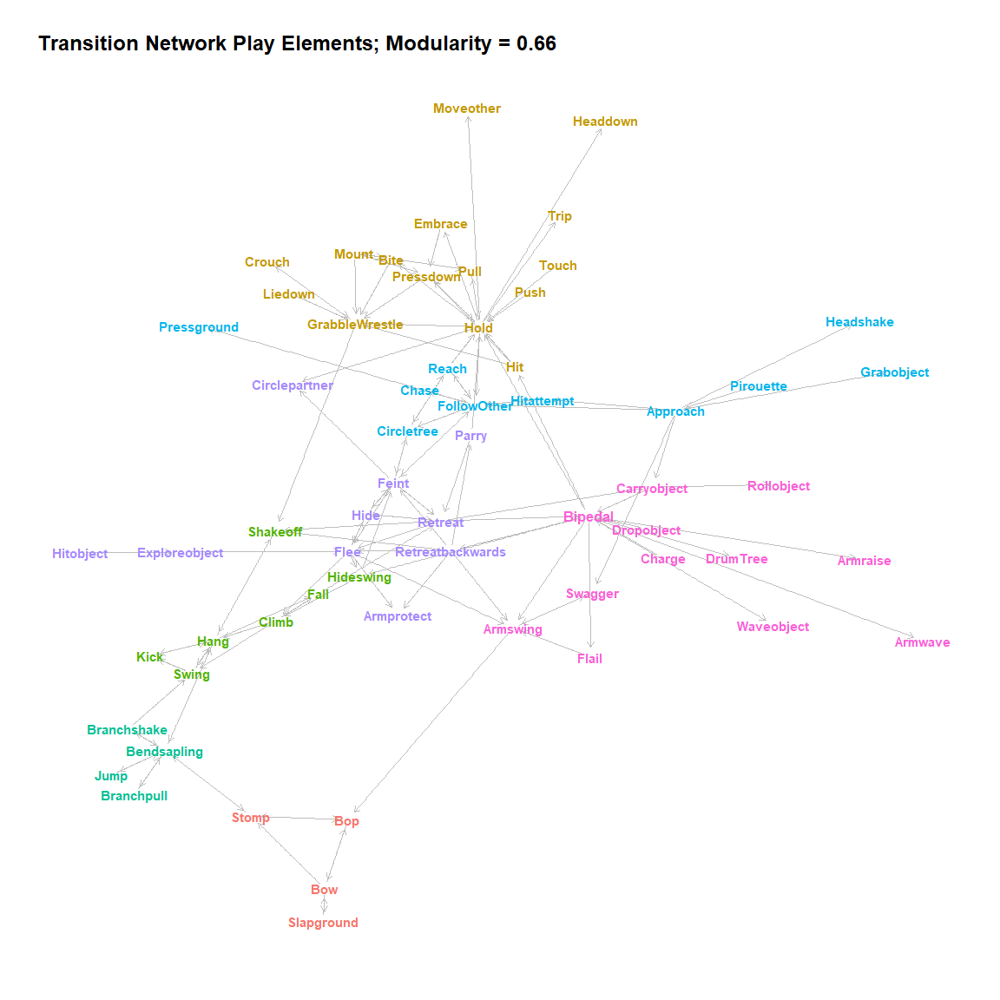

# Mielke & Carvalho 2021 ‘Chimpanzee play sequences are structured hierarchically as games’

## Abstract

Social play is ubiquitous in the development of many animal species and
involves players adapting actions flexibly to their own previous actions
and partner responses. Play differs from other behavioural contexts for
which fine-scale analyses of action sequences are available, such as
tool use and communication, in that its form is not defined by its
functions, making it potentially more unpredictable. In humans, play is
often organised in games, where players know context-appropriate actions
but string them together unpredictably. Here, we use the sequential
nature of play elements to explore whether play elements in chimpanzees
are structured hierarchically and follow predictable game-like patterns.
Based on 5711 play elements from 143 bouts, we extracted
individual-level play sequences of 11 Western chimpanzees (Pan
troglodytes verus) of different ages from the Bossou community. We
detected transition probabilities between play elements that exceeded
expected levels and show that play elements form hierarchically
clustered and interchangeable groups, indicative of at least six ‘games’
that can be identified from transition networks, some with different
roles for different players. We also show that increased information
about preceding play elements improved predictability of subsequent
elements, further indicating that play elements are not strung together
randomly but that flexible action rules underlie their usage. Thus,
chimpanzee play is hierarchically structured in short ‘games’ which
limit acceptable play elements and allow players to predict and adapt to
partners’ actions. This ‘grammar of action’ approach to social
interactions can be valuable in understanding cognitive and
communicative abilities within and across species.

## Data Preparation

Videos were coded in BORIS with the developed coding scheme - the manual
is available on GitHub and in the Supplementary. The below R script
extracts play elements from BORIS output and assigns them into bouts.
Bouts are defined as all elements that happen between the start (first
play element of either partner) and the end (neither individual shows
play elements for more than 5 seconds).

The following script extracts basic descriptive information about all
bouts, how many players exchanged how many elements for how long etc.

### Load Elements

The play elements were defined in an additional file that can be found
on GitHub. The file also contains conventions about lumping elements in
case too few cases were observed. The lumping convention was determine a
priori when developing the coding scheme based on similarity of movement
between elements.

    # get elements and their possible replacements from the .csv file in the repository
    element_table <-
      read_csv("~/GitHub/Mielke-Carvalho_Chimpanzee-Play/elements.csv", show_col_types = FALSE)
    elements <- element_table$elements

Some bouts do not contain any usable play elements and should be removed
(e.g., if they are only solitary play).

    # remove bouts that do not contain any of the elements specified above
    remove <- sapply(unique(video.data$bout.nr), function(x) {
      nrow(filter(
        video.data,
        bout.nr == x,
        !Behavior %in% c(
          "Non-Play",
          "Comment",
          "Start",
          "End",
          "Players",
          "Intervention"
        )
      )) == 0
    })
    remove <- unique(video.data$bout.nr)[remove]
    if (length(remove) > 0) {
      video.data <- filter(video.data, video.data$bout.nr != remove)
    }

### Prepare Individual-Level Bouts

What we want to end up with is a list that contains all individuals’
sequences of elements within each bout. We want other lists that contain
the respective information on the Time, the Individual, and which bout
this was taken from, for later processing.

    # go through each bout, remove useless information
    bout.data <- lapply(unique(video.data$bout.nr), function(x) {
      # select bout and sort by subject and time
      set.data <-
        filter(
          video.data,
          bout.nr == x,
          !Behavior %in% c(
            "Non-Play",
            "Comment",
            "Start",
            "End",
            "Players",
            "Intervention"
          )
        ) %>%
        arrange(Subject, Time)
      # vector with focals
      focal <- set.data$Subject
      # bout nr
      bout.nr <- sub(".*/", "", unique(set.data$bout.nr))
      # vector with time
      Time <- set.data$Time
      # put elements into list
      bout.elements <- list()
      for (i in 1:nrow(set.data)) {
        yy <-
          as.vector(unlist(strsplit(
            unlist(set.data[i, ]),
            split = ",", fixed = T
          )))
        yy <- intersect(yy, elements)
        bout.elements[[i]] <- yy
      }
      # elements that co-occur in event are combined by % symbol
      bout.elements <- sapply(bout.elements, paste, collapse = "%")
      # empty cells (i.e. those not containing a recognised element) get NA
      bout.elements[bout.elements == ""] <- NA
      return(data.frame(focal, bout.nr, Time, bout.elements))
    })
    # combine all bouts into one frame
    bout.data <- bind_rows(bout.data)
    # create individual-level bout identifier
    bout.data$bout.nr.focal <- bout.data %>%
      unite(bout.nr, bout.nr, focal, sep = "_", remove = T) %>%
      select(bout.nr)
    bout.data$bout.nr.focal <-
      as.vector(bout.data$bout.nr.focal$bout.nr)

    # create list that has one vector of elements per individual-bout
    elements.bout <-
      lapply(unique(bout.data$bout.nr.focal), function(x) {
        set.data <- filter(bout.data, bout.nr.focal == x)
        return(set.data$bout.elements)
      })

    # create list that has one vector of times per individual-bout
    elements.time <-
      lapply(unique(bout.data$bout.nr.focal), function(x) {
        set.data <- filter(bout.data, bout.nr.focal == x)
        return(set.data$Time)
      })

    # create list of focal ID per individual-bout
    bout.focal <- lapply(unique(bout.data$bout.nr.focal), function(x) {
      set.data <- filter(bout.data, bout.nr.focal == x)
      return(unique(set.data$focal))
    })

    # create list of bout ID per individual-bout
    bout.id <- lapply(unique(bout.data$bout.nr.focal), function(x) {
      set.data <- filter(bout.data, bout.nr.focal == x)
      return(unique(set.data$bout.nr))
    })

    # name element-list and time-list using individual-bout id
    names(elements.bout) <- unique(bout.data$bout.nr.focal)
    names(elements.time) <- unique(bout.data$bout.nr.focal)

Now, we should be left with four objects:

-   *elements.bout*, a list named with the individual-bout IDs,
    containing all the elements performed by the focal player in this
    bout, ordered in sequence.
-   *elements.time*, another list, named with the individual-bout IDs,
    containing all corresponding time stamps
-   *bout.focal*, another list, containing the corresponding focal IDs
-   *bout.id*, another list, containing the corresponding bout IDs

Data are separated by bout and ID and analysed as sequence of all
elements of an individual within that bout. This leads us currently to
have 143 bouts across 35 videos in which play has been identified
containing between 3 and 181 (mean = 30.3 ) elements per bout. As we
split bouts by individual, we are working with 306 individual
performances and 4970 events, giving a total of 7025 individual play
elements (after accounting for co-occurrence). A total of 11 individuals
were observed playing at least once.

The next steps will be to determine and replace rare elements, and to
handle the continuous elements.

### Replace rare elements

First we need to set a threshold for what determines a ‘rare’ element.
Here, we will use elements that occur at least **20** times. All
elements falling below this threshold will be changed to their potential
replacement, as determined a priori.

The *change\_elements* function allows for fast replacement of elements.
The *unlist\_list* and *unlist\_vector* functions are designed to unlist
element vectors and lists that contain co-occurring elements (i.e.,
those that happen at the same time). Those elements are marked by a
percentage symbol (*‘%’*) between them.

We need to find out which elements occur fewer than the set number of
times. There are a few elements that do not have a natural replacement
and will be retained despite being rare.

    # set threshould
    threshold <- 20
    # unlist elements
    unlisted_elements_table <-
      table(unlist_vector(elements.bout, method = "random"))
    # detect elements below threshold
    rare_elements <-
      unlisted_elements_table[unlisted_elements_table <= threshold]
    # show rare elements to replace
    rare_elements_replace <- element_table %>%
      filter(elements %in% names(rare_elements))
    # go through rare elements and change them
    for (i in seq_along(rare_elements_replace$elements)) {
      # some elements do not have a natural replacement; instead, they had a '-' in the table
      ## ignore those
      if (rare_elements_replace$potential_replacement[i] != "-") {
        # use 'change_elements' function to change elements one by one
        elements.bout <- change_elements(
          elements.to.change = rare_elements_replace$elements[i],
          new = rare_elements_replace$potential_replacement[i],
          elem.bout = elements.bout
        )
      }
    }

    ############ Repeat the same thing again in case some elements got missed
    unlisted_elements_table <-
      table(unlist_vector(elements.bout, method = "random"))
    # detect elements below threshold
    rare_elements <-
      unlisted_elements_table[unlisted_elements_table <= threshold]
    # show rare elements to replace
    rare_elements_replace <- element_table %>%
      filter(elements %in% names(rare_elements))
    # go through rare elements and change them
    for (i in seq_along(rare_elements_replace$elements)) {
      if (rare_elements_replace$potential_replacement[i] != "-") {
        elements.bout <- change_elements(
          elements.to.change = rare_elements_replace$elements[i],
          new = rare_elements_replace$potential_replacement[i],
          elem.bout = elements.bout
        )
      }
    }

After removing the rare elements, we have reduced the number of
individual elements from 118 to 69 elements.

### Remove continuous elements from combinations

After we have removed elements at the low end of the scale, it is worth
also checking why some elements occur at much higher frequency than
others. The seven most common elements (Bipedal, Hold, Follow-Other,
Approach, Retreat-backwards, Retreat, Flee) all share the fact that they
are continuous and therefore are noted every time a change occurs while
they are active. This is hard to explain from a language perspective,
but easy if you imagine a musical piece on the piano: sometimes one note
is held while others are played. In play, a chimpanzee can go bipedal,
but then do all kinds of other actions while the *Bipedal* is marked at
every change in event. This is not optimal. Ideally, we want a sequence
that reflects when individuals made the choice to use a specific
element - thus, they first go bipedal, then they do all the other
things. What we do in this case is that we use a function that goes
through each bout, finds cases where one of those seven elements occurs
multiple times in a row, and only retains the first case in which they
are observed (*remove\_serial*). If they stop doing the continuous
action (e.g., stop fleeing, then start again) the element is counted
again. Here is an example of what such a sequence looks like, with
*Bipedal* here occurring three times in a row.

    ## Warning in !is.null(rmarkdown::metadata$output) && rmarkdown::metadata$output
    ## %in% : 'length(x) = 4 > 1' in coercion to 'logical(1)'

<table>
<tbody>
<tr>
<td style="text-align:left;">
Bipedal
</td>
<td style="text-align:left;">
Hit%Bipedal
</td>
<td style="text-align:left;">
Bipedal%Arm-raise
</td>
<td style="text-align:left;">
Follow-Other
</td>
<td style="text-align:left;">
Charge
</td>
<td style="text-align:left;">
NA
</td>
</tr>
</tbody>
</table>

Here is a function that removes those serial occurrences of the same
elements. As the time stamps would potentially be mixed if we would not
account for them, they will be changed accordingly.

Now that we have this function, we want it to go over all the data for
each of the continuous elements and adjust them.

    for (i in names(sort(unlisted_elements_table, decreasing = T))[1:7]) {
      serial.removed <-
        remove_serial(
          elem.bout = elements.bout,
          elem.time = elements.time,
          to.remove = as.character(i),
          move.first = TRUE
        )
      elements.bout <- serial.removed$elements
      elements.time <- serial.removed$times
    }

If we look at the sequence from before, we can see that *Bipedal* now
only occurs once - in the beginning of the sequence. Thus, instead of
the player going bipedal, then being bipedal and hitting, then being
bipedal and arm raising; they are now considered to go bipedal, then hit
the partner, then raise their arm.

<table>
<tbody>
<tr>
<td style="text-align:left;">
Bipedal
</td>
<td style="text-align:left;">
Hit
</td>
<td style="text-align:left;">
Arm-raise
</td>
<td style="text-align:left;">
Follow-Other
</td>
<td style="text-align:left;">
Charge
</td>
</tr>
</tbody>
</table>

Creating a distribution plot (Figure 1), we can see that now, none of
the elements has an excessive occurrence probability any more.

    # How often does each element occur?
    unlisted_elements_table <-
      unlist_vector(elements.bout, method = "random") %>% 
      table()
    # Data frame containing words and their frequency
    word_count <- unlisted_elements_table %>%
      data.frame(stringsAsFactors = FALSE) %>% 
      rename("element" = '.', "count" = Freq) %>%
      arrange(desc(count)) %>% 
      mutate(element = as.character(element))
    zipfs_plot <- zipf_plot(
      element = word_count$element,
      occurrance = word_count$count,
      zipf = FALSE,
      title = "Distribution of Element Frequencies"
    )
    zipfs_plot$zipf.plot

Distribution of Element Occurrences. This distribution controls for the
over-exposure of some continuous elements.

## Methods and Results

All functions are available in the GitHub repository and can be loaded
like a package. Most of them require data to be structured as a list,
with each list element being a vector of elements order by their
occurrence in the sequence. Co-occurring elements are marked by the *%*
symbol, e.g., *Hit%Hold* indicates that the individual was
simultaneously hitting and holding the partner.

\###Transitions

Now that we have the dataset, we want to see which elements transition
into each other in sequences. The *transitions\_frame* function creates
a basic summary of the bigram (antecedent and consequent) and their
individual occurrence probabilities. The *elem\_info* function allows
users to get different output measures to quantify the transition -
either their sum, joint probability, conditional probability, or
pointwise mutual information. Here, we create the observed counts and
conditional probabilities of A transitioning to B. The parameter **it**
determines how many permutations of co-occurring elements should be
produced, and **ran.method** determines that these co-occurring elements
should be shuffled randomly but all used.

    # create basic table of possible transitions
    transitions <- transitions_frame(elem.bout = elements.bout,
                                     all.possible = FALSE)

    # how often does A lead to B
    transitions$observed.sum <- elem_info(
      antecedent = transitions$antecedent,
      consequent = transitions$consequent,
      elem.bout = elements.bout,
      it = 1000,
      measure = c("sum"),
      ran.method = 'random'
    )

    # conditional probability of A leading to B
    transitions$observed.probs <- round(
      elem_info(
        antecedent = transitions$antecedent,
        consequent = transitions$consequent,
        elem.bout = elements.bout,
        it = 1000,
        measure = c("prob"),
        ran.method = 'random'
      ),
      3
    )

#### Bag-of-Words

Users who would want to replicate the results using a different approach
(bag-of-words or using one randomly selected co-occurring element rather
than shuffling them and keeping all) can do so using the **ran.method**
parameter (change to ‘sample’) or using the *bag\_of\_words* function.
In most following function, adding a **gap** and **elem.time** parameter
will automatically trigger the bag-of-words approach. The **gap**
parameter specified below indicates that two elements should be counted
as transitioning if they occur within 0 to 1 sec of each other.

    # bigrams with observed probabilities of occurring within the same 'bag'
    transitions_bow <-
      bag_of_words(elem.bout = elements.bout,
                   elem.time = elements.time,
                   gap = c(0, 1))

### Transition Distribution

We visualise the output of the transitions data frame by showing the
head of the table and the overall distribution of observed conditional
transition probabilities. There are overall 1622 transitions that were
observed at least one time. The histogram shows that most elements are
followed by a number of different *consequents* - only 4 transitions
constituted more than 1/3 of all possible transitions of that
*antecedent*. At the same time, each element was observed to be followed
by between 7 and 53 elements. Thus, there is no tight coupling between
any two elements. This might indicate random assignment - any elements
could be followed by any other. However, it might also mean
situation-specific responses that are tailored to the players’ own
previous action and the partners’ reaction. To work this out, we will
look at which elements follow each other more than expected under the
assumption of randomness.

<table>
<thead>
<tr>
<th style="text-align:left;">
antecedent
</th>
<th style="text-align:left;">
consequent
</th>
<th style="text-align:right;">
observed.sum
</th>
<th style="text-align:right;">
observed.probs
</th>
</tr>
</thead>
<tbody>
<tr>
<td style="text-align:left;">
Approach
</td>
<td style="text-align:left;">
Approach
</td>
<td style="text-align:right;">
1.000
</td>
<td style="text-align:right;">
0.004
</td>
</tr>
<tr>
<td style="text-align:left;">
Approach
</td>
<td style="text-align:left;">
Armprotect
</td>
<td style="text-align:right;">
2.000
</td>
<td style="text-align:right;">
0.008
</td>
</tr>
<tr>
<td style="text-align:left;">
Approach
</td>
<td style="text-align:left;">
Armraise
</td>
<td style="text-align:right;">
1.513
</td>
<td style="text-align:right;">
0.006
</td>
</tr>
<tr>
<td style="text-align:left;">
Approach
</td>
<td style="text-align:left;">
Armswing
</td>
<td style="text-align:right;">
10.297
</td>
<td style="text-align:right;">
0.039
</td>
</tr>
<tr>
<td style="text-align:left;">
Approach
</td>
<td style="text-align:left;">
Armwave
</td>
<td style="text-align:right;">
3.509
</td>
<td style="text-align:right;">
0.013
</td>
</tr>
<tr>
<td style="text-align:left;">
Approach
</td>
<td style="text-align:left;">
Bendsapling
</td>
<td style="text-align:right;">
3.000
</td>
<td style="text-align:right;">
0.011
</td>
</tr>
<tr>
<td style="text-align:left;">
Approach
</td>
<td style="text-align:left;">
Bipedal
</td>
<td style="text-align:right;">
30.000
</td>
<td style="text-align:right;">
0.113
</td>
</tr>
<tr>
<td style="text-align:left;">
Approach
</td>
<td style="text-align:left;">
Bite
</td>
<td style="text-align:right;">
1.488
</td>
<td style="text-align:right;">
0.006
</td>
</tr>
<tr>
<td style="text-align:left;">
Approach
</td>
<td style="text-align:left;">
Bop
</td>
<td style="text-align:right;">
2.026
</td>
<td style="text-align:right;">
0.008
</td>
</tr>
<tr>
<td style="text-align:left;">
Approach
</td>
<td style="text-align:left;">
Bow
</td>
<td style="text-align:right;">
3.590
</td>
<td style="text-align:right;">
0.013
</td>
</tr>
</tbody>
</table>

    ggplot(transitions, aes(x = observed.probs)) +
      geom_histogram(fill = "grey", bins = 50, color = 'black') +
      theme_classic() +
      xlab("Conditional Transition Probabilities")

Distribution of Conditional Transition Probabilities

### Robustness of transitions

Before statistically testing which conditional probabilities are
statistically meaningful, it makes sense to visualize how robust they
are. We are working with very small samples - many transitions will be
based on a small number of events. For example, if an element only
occurs 10 times, even at random assignment, the transition probabilities
to all consequents will be at least 0.1. However, each new or missing
data point would dramatically change this pattern. This is not optimal.
To check this, we bootstrap the transition probabilities using the
*boot\_element* function: by repeatedly taking random subsets of bouts
(1000 iterations, random sampling with replacement), we can create an
interval around the observed transition probabilities, and check how
broad those intervals are. We plot the coefficient of variance for the
1000 bootstraps against the number of times the consequent was observed.
What we see is that for some rare elements, the transition probabilities
become volatile. Transition probabilities of rare elements will
therefore be interpreted with caution, and elements will be filtered to
exclude rare or highly volatile transitions.

Range of conditional transition probabilities for bigrams, plotted
against how often the antecedent occurred in the dataset.

#### Randomization approach

To test which elements reliably follow which others, we have to create a
null model of ‘expected’ transitions. To do this, we repeatedly
randomize the order of elements across bouts: while the number of
elements per bout and the position of breaks and NAs in bouts are kept
the same, we randomly assign which element occurs where in which bout.
Thus, two elements are considered to transition significantly if the
combination is observed more often than would be expected if play
elements were just strung together at random. We run 1,000
randomisations (each containing 10 random assignments of co-occurring
elements for relevant events) to create the expected distribution for
each transition and compare whether the observed transition probability
falls within this distribution or not. To compare the observed and
expected values, we provide a p-value (how many of the 10,000
randomisations show higher transition probabilities than observed), a
z-value (how many standard deviations larger than the expected
probabilities were observed values), and the ratio of observed and
expected probabilities (e.g., a probability increase of 2 means that the
observed probability was twice as large as the expected probability). To
be conservative, and given the low robustness of the data, we set the
significance level to 0.01 - thus, a transition probability is
considered significant if it is larger than 990 out of 1000 random
assignments. We also only consider transitions that are based on at
least 5 observations of the transition itself. Because of the large
number of randomisations, this function is parallelised. For the
bag-of-words approach, a *randomized\_bag\_of\_words* function exists.

Please remember that these analyses are based on resampling, so each
user will have slightly different results.

    randomizations <- randomized_elem_info(
      elem.bout = elements.bout,
      antecedent = transitions$antecedent,
      consequent = transitions$consequent,
      observed = transitions$observed.probs,
      it = 10,
      cores = 10,
      trials = 1000,
      type = "across",
      output = "expected"
    )

    transitions$expected.sum <- randomizations$sum
    transitions$expected.probs <- round(randomizations$prob, 3)
    transitions$pvalue <- round(randomizations$pvalue, 3)
    transitions$z <- round(randomizations$z, 3)
    transitions$prob.increase <-
      round(transitions$observed.probs / transitions$expected.probs, 3)

In total, 146 transitions were significant at 0.01 level and occurred at
least 5 times (i.e., we can be very certain that the observed transition
probability was outside the expected probability range). This
constitutes 9% of all observed, and 5.41% of all possible transitions.
Below is a table of all significant transitions, organised by their
increase in probability compared to expected. As can be seen, many of
those are *repeated actions* - if we see a chimpanzee player drum a
tree, we can be fairly certain that the next move will also involve
drumming a tree. Almost all possible elements (51 out of 68) showed at
least one significant transition, ranging from 1 to 11. We will explore
these connections further later-on when discussing network clusters of
transitions - for now, this result confirms our first prediction: There
are reliably predictable transition rules between play elements.

<table>
<caption>
Antecedent and consequent transition statistics for the dataset: listed
are transitions that were significant at 0.01 and occurred at least 5
times in the dataset
</caption>
<thead>
<tr>
<th style="text-align:left;">
Antecedent
</th>
<th style="text-align:left;">
Consequent
</th>
<th style="text-align:right;">
Conditional Probability
</th>
<th style="text-align:right;">
Expected Conditional Probability
</th>
<th style="text-align:right;">
p-value
</th>
<th style="text-align:right;">
Increase in Probability
</th>
</tr>
</thead>
<tbody>
<tr>
<td style="text-align:left;">
Kickdirt
</td>
<td style="text-align:left;">
Kickdirt
</td>
<td style="text-align:right;">
0.515
</td>
<td style="text-align:right;">
0.005
</td>
<td style="text-align:right;">
0.000
</td>
<td style="text-align:right;">
103.000
</td>
</tr>
<tr>
<td style="text-align:left;">
Hitobject
</td>
<td style="text-align:left;">
Hitobject
</td>
<td style="text-align:right;">
0.368
</td>
<td style="text-align:right;">
0.007
</td>
<td style="text-align:right;">
0.000
</td>
<td style="text-align:right;">
52.571
</td>
</tr>
<tr>
<td style="text-align:left;">
Branchpull
</td>
<td style="text-align:left;">
Branchpull
</td>
<td style="text-align:right;">
0.222
</td>
<td style="text-align:right;">
0.007
</td>
<td style="text-align:right;">
0.000
</td>
<td style="text-align:right;">
31.714
</td>
</tr>
<tr>
<td style="text-align:left;">
Climb
</td>
<td style="text-align:left;">
Fall
</td>
<td style="text-align:right;">
0.153
</td>
<td style="text-align:right;">
0.007
</td>
<td style="text-align:right;">
0.000
</td>
<td style="text-align:right;">
21.857
</td>
</tr>
<tr>
<td style="text-align:left;">
Hitobject
</td>
<td style="text-align:left;">
Exploreobject
</td>
<td style="text-align:right;">
0.147
</td>
<td style="text-align:right;">
0.008
</td>
<td style="text-align:right;">
0.000
</td>
<td style="text-align:right;">
18.375
</td>
</tr>
<tr>
<td style="text-align:left;">
Slapground
</td>
<td style="text-align:left;">
Bow
</td>
<td style="text-align:right;">
0.346
</td>
<td style="text-align:right;">
0.019
</td>
<td style="text-align:right;">
0.000
</td>
<td style="text-align:right;">
18.211
</td>
</tr>
<tr>
<td style="text-align:left;">
Hideswing
</td>
<td style="text-align:left;">
Climb
</td>
<td style="text-align:right;">
0.197
</td>
<td style="text-align:right;">
0.011
</td>
<td style="text-align:right;">
0.000
</td>
<td style="text-align:right;">
17.909
</td>
</tr>
<tr>
<td style="text-align:left;">
Bow
</td>
<td style="text-align:left;">
Slapground
</td>
<td style="text-align:right;">
0.226
</td>
<td style="text-align:right;">
0.014
</td>
<td style="text-align:right;">
0.000
</td>
<td style="text-align:right;">
16.143
</td>
</tr>
<tr>
<td style="text-align:left;">
Jump
</td>
<td style="text-align:left;">
Bendsapling
</td>
<td style="text-align:right;">
0.281
</td>
<td style="text-align:right;">
0.018
</td>
<td style="text-align:right;">
0.000
</td>
<td style="text-align:right;">
15.611
</td>
</tr>
<tr>
<td style="text-align:left;">
Bendsapling
</td>
<td style="text-align:left;">
Jump
</td>
<td style="text-align:right;">
0.093
</td>
<td style="text-align:right;">
0.006
</td>
<td style="text-align:right;">
0.000
</td>
<td style="text-align:right;">
15.500
</td>
</tr>
<tr>
<td style="text-align:left;">
Embrace
</td>
<td style="text-align:left;">
Pressdown
</td>
<td style="text-align:right;">
0.170
</td>
<td style="text-align:right;">
0.011
</td>
<td style="text-align:right;">
0.000
</td>
<td style="text-align:right;">
15.455
</td>
</tr>
<tr>
<td style="text-align:left;">
Carryobject
</td>
<td style="text-align:left;">
Rollobject
</td>
<td style="text-align:right;">
0.090
</td>
<td style="text-align:right;">
0.006
</td>
<td style="text-align:right;">
0.000
</td>
<td style="text-align:right;">
15.000
</td>
</tr>
<tr>
<td style="text-align:left;">
Hang
</td>
<td style="text-align:left;">
Fall
</td>
<td style="text-align:right;">
0.090
</td>
<td style="text-align:right;">
0.006
</td>
<td style="text-align:right;">
0.000
</td>
<td style="text-align:right;">
15.000
</td>
</tr>
<tr>
<td style="text-align:left;">
Slapground
</td>
<td style="text-align:left;">
Slapground
</td>
<td style="text-align:right;">
0.186
</td>
<td style="text-align:right;">
0.013
</td>
<td style="text-align:right;">
0.000
</td>
<td style="text-align:right;">
14.308
</td>
</tr>
<tr>
<td style="text-align:left;">
DrumTree
</td>
<td style="text-align:left;">
DrumTree
</td>
<td style="text-align:right;">
0.300
</td>
<td style="text-align:right;">
0.021
</td>
<td style="text-align:right;">
0.000
</td>
<td style="text-align:right;">
14.286
</td>
</tr>
<tr>
<td style="text-align:left;">
Kick
</td>
<td style="text-align:left;">
Hang
</td>
<td style="text-align:right;">
0.236
</td>
<td style="text-align:right;">
0.017
</td>
<td style="text-align:right;">
0.000
</td>
<td style="text-align:right;">
13.882
</td>
</tr>
<tr>
<td style="text-align:left;">
Branchshake
</td>
<td style="text-align:left;">
Branchshake
</td>
<td style="text-align:right;">
0.110
</td>
<td style="text-align:right;">
0.008
</td>
<td style="text-align:right;">
0.000
</td>
<td style="text-align:right;">
13.750
</td>
</tr>
<tr>
<td style="text-align:left;">
Bendsapling
</td>
<td style="text-align:left;">
Branchpull
</td>
<td style="text-align:right;">
0.095
</td>
<td style="text-align:right;">
0.007
</td>
<td style="text-align:right;">
0.000
</td>
<td style="text-align:right;">
13.571
</td>
</tr>
<tr>
<td style="text-align:left;">
Mount
</td>
<td style="text-align:left;">
Bite
</td>
<td style="text-align:right;">
0.148
</td>
<td style="text-align:right;">
0.011
</td>
<td style="text-align:right;">
0.000
</td>
<td style="text-align:right;">
13.455
</td>
</tr>
<tr>
<td style="text-align:left;">
Bite
</td>
<td style="text-align:left;">
Mount
</td>
<td style="text-align:right;">
0.119
</td>
<td style="text-align:right;">
0.009
</td>
<td style="text-align:right;">
0.000
</td>
<td style="text-align:right;">
13.222
</td>
</tr>
<tr>
<td style="text-align:left;">
Liedown
</td>
<td style="text-align:left;">
GrabbleWrestle
</td>
<td style="text-align:right;">
0.224
</td>
<td style="text-align:right;">
0.017
</td>
<td style="text-align:right;">
0.000
</td>
<td style="text-align:right;">
13.176
</td>
</tr>
<tr>
<td style="text-align:left;">
Waveobject
</td>
<td style="text-align:left;">
Waveobject
</td>
<td style="text-align:right;">
0.115
</td>
<td style="text-align:right;">
0.009
</td>
<td style="text-align:right;">
0.000
</td>
<td style="text-align:right;">
12.778
</td>
</tr>
<tr>
<td style="text-align:left;">
Hold
</td>
<td style="text-align:left;">
Trip
</td>
<td style="text-align:right;">
0.051
</td>
<td style="text-align:right;">
0.004
</td>
<td style="text-align:right;">
0.000
</td>
<td style="text-align:right;">
12.750
</td>
</tr>
<tr>
<td style="text-align:left;">
Branchpull
</td>
<td style="text-align:left;">
Bendsapling
</td>
<td style="text-align:right;">
0.224
</td>
<td style="text-align:right;">
0.018
</td>
<td style="text-align:right;">
0.000
</td>
<td style="text-align:right;">
12.444
</td>
</tr>
<tr>
<td style="text-align:left;">
Bendsapling
</td>
<td style="text-align:left;">
Bendsapling
</td>
<td style="text-align:right;">
0.215
</td>
<td style="text-align:right;">
0.018
</td>
<td style="text-align:right;">
0.000
</td>
<td style="text-align:right;">
11.944
</td>
</tr>
<tr>
<td style="text-align:left;">
Bendsapling
</td>
<td style="text-align:left;">
Branchshake
</td>
<td style="text-align:right;">
0.092
</td>
<td style="text-align:right;">
0.008
</td>
<td style="text-align:right;">
0.000
</td>
<td style="text-align:right;">
11.500
</td>
</tr>
<tr>
<td style="text-align:left;">
Bite
</td>
<td style="text-align:left;">
Bite
</td>
<td style="text-align:right;">
0.137
</td>
<td style="text-align:right;">
0.012
</td>
<td style="text-align:right;">
0.000
</td>
<td style="text-align:right;">
11.417
</td>
</tr>
<tr>
<td style="text-align:left;">
Hang
</td>
<td style="text-align:left;">
Kick
</td>
<td style="text-align:right;">
0.067
</td>
<td style="text-align:right;">
0.006
</td>
<td style="text-align:right;">
0.000
</td>
<td style="text-align:right;">
11.167
</td>
</tr>
<tr>
<td style="text-align:left;">
Stomp
</td>
<td style="text-align:left;">
Stomp
</td>
<td style="text-align:right;">
0.134
</td>
<td style="text-align:right;">
0.012
</td>
<td style="text-align:right;">
0.000
</td>
<td style="text-align:right;">
11.167
</td>
</tr>
<tr>
<td style="text-align:left;">
Climb
</td>
<td style="text-align:left;">
Hang
</td>
<td style="text-align:right;">
0.166
</td>
<td style="text-align:right;">
0.015
</td>
<td style="text-align:right;">
0.000
</td>
<td style="text-align:right;">
11.067
</td>
</tr>
<tr>
<td style="text-align:left;">
Mount
</td>
<td style="text-align:left;">
Pressdown
</td>
<td style="text-align:right;">
0.117
</td>
<td style="text-align:right;">
0.011
</td>
<td style="text-align:right;">
0.000
</td>
<td style="text-align:right;">
10.636
</td>
</tr>
<tr>
<td style="text-align:left;">
Branchshake
</td>
<td style="text-align:left;">
Bendsapling
</td>
<td style="text-align:right;">
0.186
</td>
<td style="text-align:right;">
0.018
</td>
<td style="text-align:right;">
0.000
</td>
<td style="text-align:right;">
10.333
</td>
</tr>
<tr>
<td style="text-align:left;">
Flee
</td>
<td style="text-align:left;">
Armprotect
</td>
<td style="text-align:right;">
0.082
</td>
<td style="text-align:right;">
0.008
</td>
<td style="text-align:right;">
0.000
</td>
<td style="text-align:right;">
10.250
</td>
</tr>
<tr>
<td style="text-align:left;">
Touch
</td>
<td style="text-align:left;">
Touch
</td>
<td style="text-align:right;">
0.109
</td>
<td style="text-align:right;">
0.011
</td>
<td style="text-align:right;">
0.000
</td>
<td style="text-align:right;">
9.909
</td>
</tr>
<tr>
<td style="text-align:left;">
Shakeoff
</td>
<td style="text-align:left;">
Shakeoff
</td>
<td style="text-align:right;">
0.136
</td>
<td style="text-align:right;">
0.014
</td>
<td style="text-align:right;">
0.000
</td>
<td style="text-align:right;">
9.714
</td>
</tr>
<tr>
<td style="text-align:left;">
Flee
</td>
<td style="text-align:left;">
Hideswing
</td>
<td style="text-align:right;">
0.134
</td>
<td style="text-align:right;">
0.014
</td>
<td style="text-align:right;">
0.000
</td>
<td style="text-align:right;">
9.571
</td>
</tr>
<tr>
<td style="text-align:left;">
Swing
</td>
<td style="text-align:left;">
Swing
</td>
<td style="text-align:right;">
0.143
</td>
<td style="text-align:right;">
0.015
</td>
<td style="text-align:right;">
0.000
</td>
<td style="text-align:right;">
9.533
</td>
</tr>
<tr>
<td style="text-align:left;">
Climb
</td>
<td style="text-align:left;">
Swing
</td>
<td style="text-align:right;">
0.132
</td>
<td style="text-align:right;">
0.014
</td>
<td style="text-align:right;">
0.000
</td>
<td style="text-align:right;">
9.429
</td>
</tr>
<tr>
<td style="text-align:left;">
Hang
</td>
<td style="text-align:left;">
Hang
</td>
<td style="text-align:right;">
0.134
</td>
<td style="text-align:right;">
0.015
</td>
<td style="text-align:right;">
0.000
</td>
<td style="text-align:right;">
8.933
</td>
</tr>
<tr>
<td style="text-align:left;">
Circlepartner
</td>
<td style="text-align:left;">
Circlepartner
</td>
<td style="text-align:right;">
0.086
</td>
<td style="text-align:right;">
0.010
</td>
<td style="text-align:right;">
0.000
</td>
<td style="text-align:right;">
8.600
</td>
</tr>
<tr>
<td style="text-align:left;">
Circletree
</td>
<td style="text-align:left;">
Circletree
</td>
<td style="text-align:right;">
0.162
</td>
<td style="text-align:right;">
0.019
</td>
<td style="text-align:right;">
0.000
</td>
<td style="text-align:right;">
8.526
</td>
</tr>
<tr>
<td style="text-align:left;">
Swing
</td>
<td style="text-align:left;">
Hang
</td>
<td style="text-align:right;">
0.135
</td>
<td style="text-align:right;">
0.016
</td>
<td style="text-align:right;">
0.000
</td>
<td style="text-align:right;">
8.438
</td>
</tr>
<tr>
<td style="text-align:left;">
Branchshake
</td>
<td style="text-align:left;">
Swing
</td>
<td style="text-align:right;">
0.114
</td>
<td style="text-align:right;">
0.014
</td>
<td style="text-align:right;">
0.000
</td>
<td style="text-align:right;">
8.143
</td>
</tr>
<tr>
<td style="text-align:left;">
Hang
</td>
<td style="text-align:left;">
Swing
</td>
<td style="text-align:right;">
0.111
</td>
<td style="text-align:right;">
0.014
</td>
<td style="text-align:right;">
0.000
</td>
<td style="text-align:right;">
7.929
</td>
</tr>
<tr>
<td style="text-align:left;">
FollowOther
</td>
<td style="text-align:left;">
Chase
</td>
<td style="text-align:right;">
0.071
</td>
<td style="text-align:right;">
0.009
</td>
<td style="text-align:right;">
0.000
</td>
<td style="text-align:right;">
7.889
</td>
</tr>
<tr>
<td style="text-align:left;">
Hide
</td>
<td style="text-align:left;">
Feint
</td>
<td style="text-align:right;">
0.199
</td>
<td style="text-align:right;">
0.027
</td>
<td style="text-align:right;">
0.000
</td>
<td style="text-align:right;">
7.370
</td>
</tr>
<tr>
<td style="text-align:left;">
Circletree
</td>
<td style="text-align:left;">
Feint
</td>
<td style="text-align:right;">
0.187
</td>
<td style="text-align:right;">
0.026
</td>
<td style="text-align:right;">
0.000
</td>
<td style="text-align:right;">
7.192
</td>
</tr>
<tr>
<td style="text-align:left;">
Stomp
</td>
<td style="text-align:left;">
Bop
</td>
<td style="text-align:right;">
0.086
</td>
<td style="text-align:right;">
0.012
</td>
<td style="text-align:right;">
0.000
</td>
<td style="text-align:right;">
7.167
</td>
</tr>
<tr>
<td style="text-align:left;">
Mount
</td>
<td style="text-align:left;">
GrabbleWrestle
</td>
<td style="text-align:right;">
0.119
</td>
<td style="text-align:right;">
0.017
</td>
<td style="text-align:right;">
0.000
</td>
<td style="text-align:right;">
7.000
</td>
</tr>
<tr>
<td style="text-align:left;">
Bop
</td>
<td style="text-align:left;">
Stomp
</td>
<td style="text-align:right;">
0.080
</td>
<td style="text-align:right;">
0.012
</td>
<td style="text-align:right;">
0.001
</td>
<td style="text-align:right;">
6.667
</td>
</tr>
<tr>
<td style="text-align:left;">
Bow
</td>
<td style="text-align:left;">
Bop
</td>
<td style="text-align:right;">
0.080
</td>
<td style="text-align:right;">
0.012
</td>
<td style="text-align:right;">
0.000
</td>
<td style="text-align:right;">
6.667
</td>
</tr>
<tr>
<td style="text-align:left;">
Hang
</td>
<td style="text-align:left;">
Shakeoff
</td>
<td style="text-align:right;">
0.093
</td>
<td style="text-align:right;">
0.015
</td>
<td style="text-align:right;">
0.000
</td>
<td style="text-align:right;">
6.200
</td>
</tr>
<tr>
<td style="text-align:left;">
Shakeoff
</td>
<td style="text-align:left;">
Hang
</td>
<td style="text-align:right;">
0.099
</td>
<td style="text-align:right;">
0.016
</td>
<td style="text-align:right;">
0.000
</td>
<td style="text-align:right;">
6.188
</td>
</tr>
<tr>
<td style="text-align:left;">
Approach
</td>
<td style="text-align:left;">
Headshake
</td>
<td style="text-align:right;">
0.030
</td>
<td style="text-align:right;">
0.005
</td>
<td style="text-align:right;">
0.000
</td>
<td style="text-align:right;">
6.000
</td>
</tr>
<tr>
<td style="text-align:left;">
Armswing
</td>
<td style="text-align:left;">
Swagger
</td>
<td style="text-align:right;">
0.036
</td>
<td style="text-align:right;">
0.006
</td>
<td style="text-align:right;">
0.000
</td>
<td style="text-align:right;">
6.000
</td>
</tr>
<tr>
<td style="text-align:left;">
Bop
</td>
<td style="text-align:left;">
Bow
</td>
<td style="text-align:right;">
0.114
</td>
<td style="text-align:right;">
0.019
</td>
<td style="text-align:right;">
0.000
</td>
<td style="text-align:right;">
6.000
</td>
</tr>
<tr>
<td style="text-align:left;">
Carryobject
</td>
<td style="text-align:left;">
Carryobject
</td>
<td style="text-align:right;">
0.089
</td>
<td style="text-align:right;">
0.015
</td>
<td style="text-align:right;">
0.000
</td>
<td style="text-align:right;">
5.933
</td>
</tr>
<tr>
<td style="text-align:left;">
Bendsapling
</td>
<td style="text-align:left;">
Stomp
</td>
<td style="text-align:right;">
0.071
</td>
<td style="text-align:right;">
0.012
</td>
<td style="text-align:right;">
0.000
</td>
<td style="text-align:right;">
5.917
</td>
</tr>
<tr>
<td style="text-align:left;">
Retreatbackwards
</td>
<td style="text-align:left;">
Armprotect
</td>
<td style="text-align:right;">
0.053
</td>
<td style="text-align:right;">
0.009
</td>
<td style="text-align:right;">
0.000
</td>
<td style="text-align:right;">
5.889
</td>
</tr>
<tr>
<td style="text-align:left;">
Feint
</td>
<td style="text-align:left;">
Flee
</td>
<td style="text-align:right;">
0.195
</td>
<td style="text-align:right;">
0.034
</td>
<td style="text-align:right;">
0.000
</td>
<td style="text-align:right;">
5.735
</td>
</tr>
<tr>
<td style="text-align:left;">
Hold
</td>
<td style="text-align:left;">
Moveother
</td>
<td style="text-align:right;">
0.017
</td>
<td style="text-align:right;">
0.003
</td>
<td style="text-align:right;">
0.000
</td>
<td style="text-align:right;">
5.667
</td>
</tr>
<tr>
<td style="text-align:left;">
FollowOther
</td>
<td style="text-align:left;">
Circletree
</td>
<td style="text-align:right;">
0.113
</td>
<td style="text-align:right;">
0.020
</td>
<td style="text-align:right;">
0.000
</td>
<td style="text-align:right;">
5.650
</td>
</tr>
<tr>
<td style="text-align:left;">
Hitattempt
</td>
<td style="text-align:left;">
FollowOther
</td>
<td style="text-align:right;">
0.263
</td>
<td style="text-align:right;">
0.047
</td>
<td style="text-align:right;">
0.001
</td>
<td style="text-align:right;">
5.596
</td>
</tr>
<tr>
<td style="text-align:left;">
Hang
</td>
<td style="text-align:left;">
Bendsapling
</td>
<td style="text-align:right;">
0.100
</td>
<td style="text-align:right;">
0.018
</td>
<td style="text-align:right;">
0.000
</td>
<td style="text-align:right;">
5.556
</td>
</tr>
<tr>
<td style="text-align:left;">
Chase
</td>
<td style="text-align:left;">
FollowOther
</td>
<td style="text-align:right;">
0.241
</td>
<td style="text-align:right;">
0.044
</td>
<td style="text-align:right;">
0.000
</td>
<td style="text-align:right;">
5.477
</td>
</tr>
<tr>
<td style="text-align:left;">
Bite
</td>
<td style="text-align:left;">
GrabbleWrestle
</td>
<td style="text-align:right;">
0.087
</td>
<td style="text-align:right;">
0.016
</td>
<td style="text-align:right;">
0.003
</td>
<td style="text-align:right;">
5.437
</td>
</tr>
<tr>
<td style="text-align:left;">
Bendsapling
</td>
<td style="text-align:left;">
Hang
</td>
<td style="text-align:right;">
0.085
</td>
<td style="text-align:right;">
0.016
</td>
<td style="text-align:right;">
0.000
</td>
<td style="text-align:right;">
5.312
</td>
</tr>
<tr>
<td style="text-align:left;">
Pressdown
</td>
<td style="text-align:left;">
GrabbleWrestle
</td>
<td style="text-align:right;">
0.088
</td>
<td style="text-align:right;">
0.017
</td>
<td style="text-align:right;">
0.000
</td>
<td style="text-align:right;">
5.176
</td>
</tr>
<tr>
<td style="text-align:left;">
FollowOther
</td>
<td style="text-align:left;">
Reach
</td>
<td style="text-align:right;">
0.062
</td>
<td style="text-align:right;">
0.012
</td>
<td style="text-align:right;">
0.000
</td>
<td style="text-align:right;">
5.167
</td>
</tr>
<tr>
<td style="text-align:left;">
GrabbleWrestle
</td>
<td style="text-align:left;">
Crouch
</td>
<td style="text-align:right;">
0.072
</td>
<td style="text-align:right;">
0.014
</td>
<td style="text-align:right;">
0.000
</td>
<td style="text-align:right;">
5.143
</td>
</tr>
<tr>
<td style="text-align:left;">
Hold
</td>
<td style="text-align:left;">
Embrace
</td>
<td style="text-align:right;">
0.040
</td>
<td style="text-align:right;">
0.008
</td>
<td style="text-align:right;">
0.000
</td>
<td style="text-align:right;">
5.000
</td>
</tr>
<tr>
<td style="text-align:left;">
Circletree
</td>
<td style="text-align:left;">
Reach
</td>
<td style="text-align:right;">
0.059
</td>
<td style="text-align:right;">
0.012
</td>
<td style="text-align:right;">
0.001
</td>
<td style="text-align:right;">
4.917
</td>
</tr>
<tr>
<td style="text-align:left;">
Hold
</td>
<td style="text-align:left;">
Bite
</td>
<td style="text-align:right;">
0.058
</td>
<td style="text-align:right;">
0.012
</td>
<td style="text-align:right;">
0.000
</td>
<td style="text-align:right;">
4.833
</td>
</tr>
<tr>
<td style="text-align:left;">
Bite
</td>
<td style="text-align:left;">
Pull
</td>
<td style="text-align:right;">
0.101
</td>
<td style="text-align:right;">
0.021
</td>
<td style="text-align:right;">
0.000
</td>
<td style="text-align:right;">
4.810
</td>
</tr>
<tr>
<td style="text-align:left;">
Pull
</td>
<td style="text-align:left;">
Pull
</td>
<td style="text-align:right;">
0.101
</td>
<td style="text-align:right;">
0.021
</td>
<td style="text-align:right;">
0.000
</td>
<td style="text-align:right;">
4.810
</td>
</tr>
<tr>
<td style="text-align:left;">
Push
</td>
<td style="text-align:left;">
Hold
</td>
<td style="text-align:right;">
0.269
</td>
<td style="text-align:right;">
0.056
</td>
<td style="text-align:right;">
0.000
</td>
<td style="text-align:right;">
4.804
</td>
</tr>
<tr>
<td style="text-align:left;">
Approach
</td>
<td style="text-align:left;">
Hitattempt
</td>
<td style="text-align:right;">
0.019
</td>
<td style="text-align:right;">
0.004
</td>
<td style="text-align:right;">
0.001
</td>
<td style="text-align:right;">
4.750
</td>
</tr>
<tr>
<td style="text-align:left;">
Reach
</td>
<td style="text-align:left;">
Circletree
</td>
<td style="text-align:right;">
0.090
</td>
<td style="text-align:right;">
0.019
</td>
<td style="text-align:right;">
0.000
</td>
<td style="text-align:right;">
4.737
</td>
</tr>
<tr>
<td style="text-align:left;">
Hit
</td>
<td style="text-align:left;">
Hit
</td>
<td style="text-align:right;">
0.127
</td>
<td style="text-align:right;">
0.027
</td>
<td style="text-align:right;">
0.000
</td>
<td style="text-align:right;">
4.704
</td>
</tr>
<tr>
<td style="text-align:left;">
Flee
</td>
<td style="text-align:left;">
Climb
</td>
<td style="text-align:right;">
0.051
</td>
<td style="text-align:right;">
0.011
</td>
<td style="text-align:right;">
0.000
</td>
<td style="text-align:right;">
4.636
</td>
</tr>
<tr>
<td style="text-align:left;">
Stomp
</td>
<td style="text-align:left;">
Bendsapling
</td>
<td style="text-align:right;">
0.085
</td>
<td style="text-align:right;">
0.019
</td>
<td style="text-align:right;">
0.000
</td>
<td style="text-align:right;">
4.474
</td>
</tr>
<tr>
<td style="text-align:left;">
Swagger
</td>
<td style="text-align:left;">
Armswing
</td>
<td style="text-align:right;">
0.152
</td>
<td style="text-align:right;">
0.034
</td>
<td style="text-align:right;">
0.000
</td>
<td style="text-align:right;">
4.471
</td>
</tr>
<tr>
<td style="text-align:left;">
GrabbleWrestle
</td>
<td style="text-align:left;">
Shakeoff
</td>
<td style="text-align:right;">
0.061
</td>
<td style="text-align:right;">
0.014
</td>
<td style="text-align:right;">
0.000
</td>
<td style="text-align:right;">
4.357
</td>
</tr>
<tr>
<td style="text-align:left;">
Reach
</td>
<td style="text-align:left;">
Hold
</td>
<td style="text-align:right;">
0.241
</td>
<td style="text-align:right;">
0.056
</td>
<td style="text-align:right;">
0.000
</td>
<td style="text-align:right;">
4.304
</td>
</tr>
<tr>
<td style="text-align:left;">
Dropobject
</td>
<td style="text-align:left;">
Bipedal
</td>
<td style="text-align:right;">
0.333
</td>
<td style="text-align:right;">
0.078
</td>
<td style="text-align:right;">
0.000
</td>
<td style="text-align:right;">
4.269
</td>
</tr>
<tr>
<td style="text-align:left;">
GrabbleWrestle
</td>
<td style="text-align:left;">
Hold
</td>
<td style="text-align:right;">
0.232
</td>
<td style="text-align:right;">
0.055
</td>
<td style="text-align:right;">
0.000
</td>
<td style="text-align:right;">
4.218
</td>
</tr>
<tr>
<td style="text-align:left;">
Flee
</td>
<td style="text-align:left;">
Hide
</td>
<td style="text-align:right;">
0.070
</td>
<td style="text-align:right;">
0.017
</td>
<td style="text-align:right;">
0.000
</td>
<td style="text-align:right;">
4.118
</td>
</tr>
<tr>
<td style="text-align:left;">
Pirouette
</td>
<td style="text-align:left;">
Approach
</td>
<td style="text-align:right;">
0.200
</td>
<td style="text-align:right;">
0.049
</td>
<td style="text-align:right;">
0.003
</td>
<td style="text-align:right;">
4.082
</td>
</tr>
<tr>
<td style="text-align:left;">
Feint
</td>
<td style="text-align:left;">
Circletree
</td>
<td style="text-align:right;">
0.077
</td>
<td style="text-align:right;">
0.019
</td>
<td style="text-align:right;">
0.000
</td>
<td style="text-align:right;">
4.053
</td>
</tr>
<tr>
<td style="text-align:left;">
Approach
</td>
<td style="text-align:left;">
Swagger
</td>
<td style="text-align:right;">
0.028
</td>
<td style="text-align:right;">
0.007
</td>
<td style="text-align:right;">
0.000
</td>
<td style="text-align:right;">
4.000
</td>
</tr>
<tr>
<td style="text-align:left;">
Bipedal
</td>
<td style="text-align:left;">
Flail
</td>
<td style="text-align:right;">
0.028
</td>
<td style="text-align:right;">
0.007
</td>
<td style="text-align:right;">
0.000
</td>
<td style="text-align:right;">
4.000
</td>
</tr>
<tr>
<td style="text-align:left;">
Crouch
</td>
<td style="text-align:left;">
GrabbleWrestle
</td>
<td style="text-align:right;">
0.068
</td>
<td style="text-align:right;">
0.017
</td>
<td style="text-align:right;">
0.002
</td>
<td style="text-align:right;">
4.000
</td>
</tr>
<tr>
<td style="text-align:left;">
Approach
</td>
<td style="text-align:left;">
Carryobject
</td>
<td style="text-align:right;">
0.059
</td>
<td style="text-align:right;">
0.015
</td>
<td style="text-align:right;">
0.000
</td>
<td style="text-align:right;">
3.933
</td>
</tr>
<tr>
<td style="text-align:left;">
Bow
</td>
<td style="text-align:left;">
Stomp
</td>
<td style="text-align:right;">
0.050
</td>
<td style="text-align:right;">
0.013
</td>
<td style="text-align:right;">
0.003
</td>
<td style="text-align:right;">
3.846
</td>
</tr>
<tr>
<td style="text-align:left;">
Retreat
</td>
<td style="text-align:left;">
Carryobject
</td>
<td style="text-align:right;">
0.057
</td>
<td style="text-align:right;">
0.015
</td>
<td style="text-align:right;">
0.000
</td>
<td style="text-align:right;">
3.800
</td>
</tr>
<tr>
<td style="text-align:left;">
Approach
</td>
<td style="text-align:left;">
Grabobject
</td>
<td style="text-align:right;">
0.034
</td>
<td style="text-align:right;">
0.009
</td>
<td style="text-align:right;">
0.000
</td>
<td style="text-align:right;">
3.778
</td>
</tr>
<tr>
<td style="text-align:left;">
Pull
</td>
<td style="text-align:left;">
Hold
</td>
<td style="text-align:right;">
0.211
</td>
<td style="text-align:right;">
0.056
</td>
<td style="text-align:right;">
0.000
</td>
<td style="text-align:right;">
3.768
</td>
</tr>
<tr>
<td style="text-align:left;">
Bipedal
</td>
<td style="text-align:left;">
DrumTree
</td>
<td style="text-align:right;">
0.073
</td>
<td style="text-align:right;">
0.020
</td>
<td style="text-align:right;">
0.000
</td>
<td style="text-align:right;">
3.650
</td>
</tr>
<tr>
<td style="text-align:left;">
Hideswing
</td>
<td style="text-align:left;">
Feint
</td>
<td style="text-align:right;">
0.094
</td>
<td style="text-align:right;">
0.026
</td>
<td style="text-align:right;">
0.001
</td>
<td style="text-align:right;">
3.615
</td>
</tr>
<tr>
<td style="text-align:left;">
Bipedal
</td>
<td style="text-align:left;">
Waveobject
</td>
<td style="text-align:right;">
0.032
</td>
<td style="text-align:right;">
0.009
</td>
<td style="text-align:right;">
0.000
</td>
<td style="text-align:right;">
3.556
</td>
</tr>
<tr>
<td style="text-align:left;">
Hide
</td>
<td style="text-align:left;">
Hide
</td>
<td style="text-align:right;">
0.060
</td>
<td style="text-align:right;">
0.017
</td>
<td style="text-align:right;">
0.003
</td>
<td style="text-align:right;">
3.529
</td>
</tr>
<tr>
<td style="text-align:left;">
Hide
</td>
<td style="text-align:left;">
Flee
</td>
<td style="text-align:right;">
0.123
</td>
<td style="text-align:right;">
0.035
</td>
<td style="text-align:right;">
0.000
</td>
<td style="text-align:right;">
3.514
</td>
</tr>
<tr>
<td style="text-align:left;">
Fall
</td>
<td style="text-align:left;">
Retreat
</td>
<td style="text-align:right;">
0.147
</td>
<td style="text-align:right;">
0.042
</td>
<td style="text-align:right;">
0.007
</td>
<td style="text-align:right;">
3.500
</td>
</tr>
<tr>
<td style="text-align:left;">
Feint
</td>
<td style="text-align:left;">
Circlepartner
</td>
<td style="text-align:right;">
0.035
</td>
<td style="text-align:right;">
0.010
</td>
<td style="text-align:right;">
0.006
</td>
<td style="text-align:right;">
3.500
</td>
</tr>
<tr>
<td style="text-align:left;">
Feint
</td>
<td style="text-align:left;">
Hide
</td>
<td style="text-align:right;">
0.059
</td>
<td style="text-align:right;">
0.017
</td>
<td style="text-align:right;">
0.000
</td>
<td style="text-align:right;">
3.471
</td>
</tr>
<tr>
<td style="text-align:left;">
Hold
</td>
<td style="text-align:left;">
Pressdown
</td>
<td style="text-align:right;">
0.038
</td>
<td style="text-align:right;">
0.011
</td>
<td style="text-align:right;">
0.000
</td>
<td style="text-align:right;">
3.455
</td>
</tr>
<tr>
<td style="text-align:left;">
FollowOther
</td>
<td style="text-align:left;">
Pressground
</td>
<td style="text-align:right;">
0.024
</td>
<td style="text-align:right;">
0.007
</td>
<td style="text-align:right;">
0.007
</td>
<td style="text-align:right;">
3.429
</td>
</tr>
<tr>
<td style="text-align:left;">
Armswing
</td>
<td style="text-align:left;">
Bop
</td>
<td style="text-align:right;">
0.040
</td>
<td style="text-align:right;">
0.012
</td>
<td style="text-align:right;">
0.001
</td>
<td style="text-align:right;">
3.333
</td>
</tr>
<tr>
<td style="text-align:left;">
Retreat
</td>
<td style="text-align:left;">
Shakeoff
</td>
<td style="text-align:right;">
0.050
</td>
<td style="text-align:right;">
0.015
</td>
<td style="text-align:right;">
0.000
</td>
<td style="text-align:right;">
3.333
</td>
</tr>
<tr>
<td style="text-align:left;">
Bipedal
</td>
<td style="text-align:left;">
Armraise
</td>
<td style="text-align:right;">
0.023
</td>
<td style="text-align:right;">
0.007
</td>
<td style="text-align:right;">
0.000
</td>
<td style="text-align:right;">
3.286
</td>
</tr>
<tr>
<td style="text-align:left;">
Bipedal
</td>
<td style="text-align:left;">
Armwave
</td>
<td style="text-align:right;">
0.013
</td>
<td style="text-align:right;">
0.004
</td>
<td style="text-align:right;">
0.008
</td>
<td style="text-align:right;">
3.250
</td>
</tr>
<tr>
<td style="text-align:left;">
Hit
</td>
<td style="text-align:left;">
Pressdown
</td>
<td style="text-align:right;">
0.039
</td>
<td style="text-align:right;">
0.012
</td>
<td style="text-align:right;">
0.006
</td>
<td style="text-align:right;">
3.250
</td>
</tr>
<tr>
<td style="text-align:left;">
Pressdown
</td>
<td style="text-align:left;">
Hold
</td>
<td style="text-align:right;">
0.174
</td>
<td style="text-align:right;">
0.054
</td>
<td style="text-align:right;">
0.000
</td>
<td style="text-align:right;">
3.222
</td>
</tr>
<tr>
<td style="text-align:left;">
Hit
</td>
<td style="text-align:left;">
Hold
</td>
<td style="text-align:right;">
0.177
</td>
<td style="text-align:right;">
0.056
</td>
<td style="text-align:right;">
0.000
</td>
<td style="text-align:right;">
3.161
</td>
</tr>
<tr>
<td style="text-align:left;">
Hold
</td>
<td style="text-align:left;">
Headdown
</td>
<td style="text-align:right;">
0.018
</td>
<td style="text-align:right;">
0.006
</td>
<td style="text-align:right;">
0.009
</td>
<td style="text-align:right;">
3.000
</td>
</tr>
<tr>
<td style="text-align:left;">
Parry
</td>
<td style="text-align:left;">
Retreat
</td>
<td style="text-align:right;">
0.126
</td>
<td style="text-align:right;">
0.042
</td>
<td style="text-align:right;">
0.000
</td>
<td style="text-align:right;">
3.000
</td>
</tr>
<tr>
<td style="text-align:left;">
Feint
</td>
<td style="text-align:left;">
FollowOther
</td>
<td style="text-align:right;">
0.137
</td>
<td style="text-align:right;">
0.046
</td>
<td style="text-align:right;">
0.000
</td>
<td style="text-align:right;">
2.978
</td>
</tr>
<tr>
<td style="text-align:left;">
Bipedal
</td>
<td style="text-align:left;">
Armswing
</td>
<td style="text-align:right;">
0.101
</td>
<td style="text-align:right;">
0.034
</td>
<td style="text-align:right;">
0.000
</td>
<td style="text-align:right;">
2.971
</td>
</tr>
<tr>
<td style="text-align:left;">
Reach
</td>
<td style="text-align:left;">
FollowOther
</td>
<td style="text-align:right;">
0.128
</td>
<td style="text-align:right;">
0.044
</td>
<td style="text-align:right;">
0.002
</td>
<td style="text-align:right;">
2.909
</td>
</tr>
<tr>
<td style="text-align:left;">
Touch
</td>
<td style="text-align:left;">
Hold
</td>
<td style="text-align:right;">
0.160
</td>
<td style="text-align:right;">
0.055
</td>
<td style="text-align:right;">
0.002
</td>
<td style="text-align:right;">
2.909
</td>
</tr>
<tr>
<td style="text-align:left;">
Hide
</td>
<td style="text-align:left;">
Retreat
</td>
<td style="text-align:right;">
0.122
</td>
<td style="text-align:right;">
0.042
</td>
<td style="text-align:right;">
0.000
</td>
<td style="text-align:right;">
2.905
</td>
</tr>
<tr>
<td style="text-align:left;">
FollowOther
</td>
<td style="text-align:left;">
Feint
</td>
<td style="text-align:right;">
0.078
</td>
<td style="text-align:right;">
0.027
</td>
<td style="text-align:right;">
0.000
</td>
<td style="text-align:right;">
2.889
</td>
</tr>
<tr>
<td style="text-align:left;">
Parry
</td>
<td style="text-align:left;">
Hold
</td>
<td style="text-align:right;">
0.164
</td>
<td style="text-align:right;">
0.057
</td>
<td style="text-align:right;">
0.000
</td>
<td style="text-align:right;">
2.877
</td>
</tr>
<tr>
<td style="text-align:left;">
Approach
</td>
<td style="text-align:left;">
FollowOther
</td>
<td style="text-align:right;">
0.132
</td>
<td style="text-align:right;">
0.046
</td>
<td style="text-align:right;">
0.000
</td>
<td style="text-align:right;">
2.870
</td>
</tr>
<tr>
<td style="text-align:left;">
Bipedal
</td>
<td style="text-align:left;">
Hideswing
</td>
<td style="text-align:right;">
0.040
</td>
<td style="text-align:right;">
0.014
</td>
<td style="text-align:right;">
0.000
</td>
<td style="text-align:right;">
2.857
</td>
</tr>
<tr>
<td style="text-align:left;">
Feint
</td>
<td style="text-align:left;">
Retreat
</td>
<td style="text-align:right;">
0.116
</td>
<td style="text-align:right;">
0.041
</td>
<td style="text-align:right;">
0.000
</td>
<td style="text-align:right;">
2.829
</td>
</tr>
<tr>
<td style="text-align:left;">
Retreatbackwards
</td>
<td style="text-align:left;">
Parry
</td>
<td style="text-align:right;">
0.053
</td>
<td style="text-align:right;">
0.019
</td>
<td style="text-align:right;">
0.000
</td>
<td style="text-align:right;">
2.789
</td>
</tr>
<tr>
<td style="text-align:left;">
Retreatbackwards
</td>
<td style="text-align:left;">
Flee
</td>
<td style="text-align:right;">
0.091
</td>
<td style="text-align:right;">
0.033
</td>
<td style="text-align:right;">
0.000
</td>
<td style="text-align:right;">
2.758
</td>
</tr>
<tr>
<td style="text-align:left;">
Hold
</td>
<td style="text-align:left;">
Circlepartner
</td>
<td style="text-align:right;">
0.030
</td>
<td style="text-align:right;">
0.011
</td>
<td style="text-align:right;">
0.003
</td>
<td style="text-align:right;">
2.727
</td>
</tr>
<tr>
<td style="text-align:left;">
Charge
</td>
<td style="text-align:left;">
Bipedal
</td>
<td style="text-align:right;">
0.215
</td>
<td style="text-align:right;">
0.081
</td>
<td style="text-align:right;">
0.007
</td>
<td style="text-align:right;">
2.654
</td>
</tr>
<tr>
<td style="text-align:left;">
Hold
</td>
<td style="text-align:left;">
FollowOther
</td>
<td style="text-align:right;">
0.122
</td>
<td style="text-align:right;">
0.046
</td>
<td style="text-align:right;">
0.000
</td>
<td style="text-align:right;">
2.652
</td>
</tr>
<tr>
<td style="text-align:left;">
Hold
</td>
<td style="text-align:left;">
Mount
</td>
<td style="text-align:right;">
0.021
</td>
<td style="text-align:right;">
0.008
</td>
<td style="text-align:right;">
0.010
</td>
<td style="text-align:right;">
2.625
</td>
</tr>
<tr>
<td style="text-align:left;">
Hold
</td>
<td style="text-align:left;">
Pull
</td>
<td style="text-align:right;">
0.053
</td>
<td style="text-align:right;">
0.021
</td>
<td style="text-align:right;">
0.000
</td>
<td style="text-align:right;">
2.524
</td>
</tr>
<tr>
<td style="text-align:left;">
Bipedal
</td>
<td style="text-align:left;">
Hit
</td>
<td style="text-align:right;">
0.068
</td>
<td style="text-align:right;">
0.028
</td>
<td style="text-align:right;">
0.000
</td>
<td style="text-align:right;">
2.429
</td>
</tr>
<tr>
<td style="text-align:left;">
Retreatbackwards
</td>
<td style="text-align:left;">
Shakeoff
</td>
<td style="text-align:right;">
0.036
</td>
<td style="text-align:right;">
0.015
</td>
<td style="text-align:right;">
0.008
</td>
<td style="text-align:right;">
2.400
</td>
</tr>
<tr>
<td style="text-align:left;">
Retreat
</td>
<td style="text-align:left;">
Flee
</td>
<td style="text-align:right;">
0.081
</td>
<td style="text-align:right;">
0.034
</td>
<td style="text-align:right;">
0.001
</td>
<td style="text-align:right;">
2.382
</td>
</tr>
<tr>
<td style="text-align:left;">
Carryobject
</td>
<td style="text-align:left;">
Bipedal
</td>
<td style="text-align:right;">
0.186
</td>
<td style="text-align:right;">
0.079
</td>
<td style="text-align:right;">
0.002
</td>
<td style="text-align:right;">
2.354
</td>
</tr>
<tr>
<td style="text-align:left;">
Hold
</td>
<td style="text-align:left;">
Crouch
</td>
<td style="text-align:right;">
0.031
</td>
<td style="text-align:right;">
0.014
</td>
<td style="text-align:right;">
0.010
</td>
<td style="text-align:right;">
2.214
</td>
</tr>
<tr>
<td style="text-align:left;">
Shakeoff
</td>
<td style="text-align:left;">
Hold
</td>
<td style="text-align:right;">
0.117
</td>
<td style="text-align:right;">
0.055
</td>
<td style="text-align:right;">
0.010
</td>
<td style="text-align:right;">
2.127
</td>
</tr>
<tr>
<td style="text-align:left;">
Bipedal
</td>
<td style="text-align:left;">
Hold
</td>
<td style="text-align:right;">
0.119
</td>
<td style="text-align:right;">
0.056
</td>
<td style="text-align:right;">
0.000
</td>
<td style="text-align:right;">
2.125
</td>
</tr>
<tr>
<td style="text-align:left;">
Retreatbackwards
</td>
<td style="text-align:left;">
Armswing
</td>
<td style="text-align:right;">
0.071
</td>
<td style="text-align:right;">
0.034
</td>
<td style="text-align:right;">
0.000
</td>
<td style="text-align:right;">
2.088
</td>
</tr>
<tr>
<td style="text-align:left;">
Flee
</td>
<td style="text-align:left;">
Armswing
</td>
<td style="text-align:right;">
0.070
</td>
<td style="text-align:right;">
0.034
</td>
<td style="text-align:right;">
0.009
</td>
<td style="text-align:right;">
2.059
</td>
</tr>
<tr>
<td style="text-align:left;">
Retreatbackwards
</td>
<td style="text-align:left;">
Feint
</td>
<td style="text-align:right;">
0.055
</td>
<td style="text-align:right;">
0.027
</td>
<td style="text-align:right;">
0.006
</td>
<td style="text-align:right;">
2.037
</td>
</tr>
<tr>
<td style="text-align:left;">
Retreat
</td>
<td style="text-align:left;">
Bipedal
</td>
<td style="text-align:right;">
0.158
</td>
<td style="text-align:right;">
0.078
</td>
<td style="text-align:right;">
0.000
</td>
<td style="text-align:right;">
2.026
</td>
</tr>
<tr>
<td style="text-align:left;">
Bipedal
</td>
<td style="text-align:left;">
Retreatbackwards
</td>
<td style="text-align:right;">
0.092
</td>
<td style="text-align:right;">
0.046
</td>
<td style="text-align:right;">
0.000
</td>
<td style="text-align:right;">
2.000
</td>
</tr>
<tr>
<td style="text-align:left;">
Retreat
</td>
<td style="text-align:left;">
Approach
</td>
<td style="text-align:right;">
0.081
</td>
<td style="text-align:right;">
0.048
</td>
<td style="text-align:right;">
0.010
</td>
<td style="text-align:right;">
1.688
</td>
</tr>
</tbody>
</table>

    ggplot(transitions, aes(x = prob.increase)) +
      geom_histogram(fill = "grey", bins = 50, color = 'black') +
      geom_vline(mapping = aes(xintercept = 1), linetype = 2) +
      theme_classic() +
      xlab("Ratio Observed/Expected Probabilities")

Distribution of Ratio of Observed and Expected Probabilities

In Table 2, we can see the 140 transitions that occurred at a
higher-than-expected rate and occurred at least 5 times (0.0863132% of
all transitions). There is a connection between sample size and effect
size: very high probability increases are connected to very rare
elements. They are also connected to loops: some of the most predictable
transitions are between an element and itself (e.g., *Kick-dirt*),
because individuals repeat the action multiple times.

## Prediction of consequent elements

One thing that would be important is whether this number of predictable
transitions indicates that it is easy for individuals to predict which
elements follows which, and how much flexibility there is in the system.
We will test the amount of predictability by applying the transition
probabilities directly: we go through the bouts of the dataset one by
one, create the probabilities for all other bouts, and then predict the
elements of the bout one by one (‘leave-one-out’). So, let’s say we know
that the first element in a bout is *Approach*. We then use the
transition probabilities to predict the second element and record
whether this prediction was correct. We then take the actual next
element to predict the third, and so on. We will test what the expected
correct classification would be if the consequent element is only
determine by the occurrence probability of each element, without taking
transition information into account (null model). The difference between
this value and the observed prediction accuracy of the models will tell
us how much knowledge of the antecedent increases our predictions. Aside
from using one element as antecedent (describing a Markov Process), we
will repeat the procedure using two and three elements as antecedents.
If the prediction accuracy under those conditions is higher than for one
element, this indicates hierarchical processes - for example, if *hit*
leads to *hold* in 10% of the time, but *stare at* plus *hit* leads to
*hold* in 80% of the time, then the preceding element adds information.
This hierarchical structure is an important component of human syntax
and other action systems, but has not been shown for primate
interactions.

<table>
<caption>
Prediction accuracy of applied transition probabilities at different
levels: level 0 is the prediction based on the simple occurrence
probability of each element, level 1 has one antecedent element, level 2
has two antecedents, etc
</caption>
<thead>
<tr>
<th style="text-align:right;">
Level
</th>
<th style="text-align:right;">
Prediction Accuracy
</th>
<th style="text-align:right;">
Prediction Accuracy Naive Bayes
</th>
</tr>
</thead>
<tbody>
<tr>
<td style="text-align:right;">
0
</td>
<td style="text-align:right;">
0.027
</td>
<td style="text-align:right;">
0.089
</td>
</tr>
<tr>
<td style="text-align:right;">
1
</td>
<td style="text-align:right;">
0.057
</td>
<td style="text-align:right;">
0.176
</td>
</tr>
<tr>
<td style="text-align:right;">
2
</td>
<td style="text-align:right;">
0.097
</td>
<td style="text-align:right;">
0.242
</td>
</tr>
<tr>
<td style="text-align:right;">
3
</td>
<td style="text-align:right;">
0.098
</td>
<td style="text-align:right;">
0.318
</td>
</tr>
</tbody>
</table>

As we see in Table 3, the null probability of getting a correct
classification (based only on element occurrence rates) is about 2.7%.
Using the conditional probability based on one antecedent (A –&gt; B)
increases this to 5.7% accuracy, and based on two antecedents (AB –&gt;
C) increases the accuracy to 9.7%. This is almost a doubling of correct
predictions. These results would probably improve further with
increasing sample sizes. Using a Naive Bayes predictor further improves
predictions. These results indicate that a) having knowledge of the
preceding element allows us to make more accurate predictions than
expected, so non-random connections allow others to adapt to their
partner’s actions; b) that having information about more previous
elements further improves accuracy, creating the possibility of
higher-order sequence effects.

## Element Clusters - Occurrance of Games

### Similarity between elements in usage

We can analyse the usage statistics of each element in this light. We
can do this for each element, by studying which elements are likely
antecedents and consequents of that element (Fig.3 for *feint*, showing
that it is connect bidirectionally with *circle-tree*, *follow*, *hide*,
*retreat*, and precedes *circle-partner* and rarely *press ground*, and
follows *hide-swing*). We can also analyse which elements are used in
similar ways and whether we find clusters of similar elements. This is
similar to the identification of synonyms in language: for example, the
words *jump* and *hop* will usually occur in similar situations. We do
this by taking the transition probabilities of all elements with all
other elements and calculating the distance between elements (Fig. 4).
Similarity can be established on the conditional transitions
probabilities or mutual information, a measure of how much the presence
of one element informs the presence of the other one. Clusters are
detected using UMAP dimension reduction algorithm and K-means
clustering.

Ego Network of Feint, with elements that are likely to precede and
follow it

    ## Warning: `distinct_()` was deprecated in dplyr 0.7.0.
    ## Please use `distinct()` instead.
    ## See vignette('programming') for more help
    ## This warning is displayed once every 8 hours.
    ## Call `lifecycle::last_lifecycle_warnings()` to see where this warning was generated.

Dendrogram of elements with similar usage statistics

What we observe is a relatively good cluster solution (0.6182128); any
solution above 0.3 can be considered to show that there is more
similarity within than between clusters. There are 11 clusters. These
are usually composed of elements that involve similar actions. E.g,
there is one containing all *push*, *pull*, *hit*, *hold* etc, so
contact play. Another contains *hanging* from and *climbing* tree,
*pulling branches*, *bending saplings* etc - play in trees. One contains most
of the object-related play, *grab-object*, *carry-object* etc. Elements
in a cluster show similar usage patterns, so elements that fall into the
same cluster can act as ‘synonyms’ - whether individuals *press down*
the partner or *hold* them might not be important for the progression of
play. This might also indicate that the coding scheme includes some
distinctions that are less relevant for the chimpanzees - for example,
*rolling object* and *kick dirt* differ in the presence of an object, but might be
used the same way (to get the partners attention).

### Transition Networks

Similar usage of some elements is part of the puzzle of how elements are
connected, and whether there are ‘games’ in chimpanzee play. The other
question is: if elements show similar usage, *how* are they connected?
In Figure 5, we can see a network where the nodes represent the elements
and edges represent significant connections. Links are weighted and
directed (AB is different from BA), with arrows indicating
directionality. To account for uncertainty, we only include significant
transitions that occurred at least 5 times. Clusters are represented by
different colours.

Transition Network

We can see that, similar to the similarity plot, there are clusters of
highly connected elements that transition into each other regularly. It
becomes clear that there are some elements (*hold*,*bipedal*) that have
high usage probability and are at the centre of clusters. In total, 27%
of transitions occurred within clusters, while 43.5% would be expected -
a 1.6 times increase.

Below is a table summarising the cluster assignment for each element for
the similarity and transition networks. The interpretation can be found
in the manuscript.

<table>
<caption>
Cluster assignment for play elements
</caption>
<thead>
<tr>
<th style="text-align:left;">
element
</th>
<th style="text-align:right;">
dendrogram.cluster
</th>
<th style="text-align:right;">
community
</th>
</tr>
</thead>
<tbody>
<tr>
<td style="text-align:left;">
Approach
</td>
<td style="text-align:right;">
1
</td>
<td style="text-align:right;">
1
</td>
</tr>
<tr>
<td style="text-align:left;">
Chase
</td>
<td style="text-align:right;">
2
</td>
<td style="text-align:right;">
1
</td>
</tr>
<tr>
<td style="text-align:left;">
Circletree
</td>
<td style="text-align:right;">
2
</td>
<td style="text-align:right;">
1
</td>
</tr>
<tr>
<td style="text-align:left;">
Lead
</td>
<td style="text-align:right;">
2
</td>
<td style="text-align:right;">
1
</td>
</tr>
<tr>
<td style="text-align:left;">
Charge
</td>
<td style="text-align:right;">
3
</td>
<td style="text-align:right;">
1
</td>
</tr>
<tr>
<td style="text-align:left;">
Hitattempt
</td>
<td style="text-align:right;">
3
</td>
<td style="text-align:right;">
1
</td>
</tr>
<tr>
<td style="text-align:left;">
Pirouette
</td>
<td style="text-align:right;">
7
</td>
<td style="text-align:right;">
1
</td>
</tr>
<tr>
<td style="text-align:left;">
FollowOther
</td>
<td style="text-align:right;">
8
</td>
<td style="text-align:right;">
1
</td>
</tr>
<tr>
<td style="text-align:left;">
Reach
</td>
<td style="text-align:right;">
8
</td>
<td style="text-align:right;">
1
</td>
</tr>
<tr>
<td style="text-align:left;">
Headshake
</td>
<td style="text-align:right;">
10
</td>
<td style="text-align:right;">
1
</td>
</tr>
<tr>
<td style="text-align:left;">
Armswing
</td>
<td style="text-align:right;">
1
</td>
<td style="text-align:right;">
2
</td>
</tr>
<tr>
<td style="text-align:left;">
Bipedal
</td>
<td style="text-align:right;">
1
</td>
<td style="text-align:right;">
2
</td>
</tr>
<tr>
<td style="text-align:left;">
DrumTree
</td>
<td style="text-align:right;">
1
</td>
<td style="text-align:right;">
2
</td>
</tr>
<tr>
<td style="text-align:left;">
Carryobject
</td>
<td style="text-align:right;">
3
</td>
<td style="text-align:right;">
2
</td>
</tr>
<tr>
<td style="text-align:left;">
Grabobject
</td>
<td style="text-align:right;">
3
</td>
<td style="text-align:right;">
2
</td>
</tr>
<tr>
<td style="text-align:left;">
Dropobject
</td>
<td style="text-align:right;">
3
</td>
<td style="text-align:right;">
2
</td>
</tr>
<tr>
<td style="text-align:left;">
Waveobject
</td>
<td style="text-align:right;">
3
</td>
<td style="text-align:right;">
2
</td>
</tr>
<tr>
<td style="text-align:left;">
Armraise
</td>
<td style="text-align:right;">
3
</td>
<td style="text-align:right;">
2
</td>
</tr>
<tr>
<td style="text-align:left;">
Flail
</td>
<td style="text-align:right;">
3
</td>
<td style="text-align:right;">
2
</td>
</tr>
<tr>
<td style="text-align:left;">
Armwave
</td>
<td style="text-align:right;">
3
</td>
<td style="text-align:right;">
2
</td>
</tr>
<tr>
<td style="text-align:left;">
Swagger
</td>
<td style="text-align:right;">
3
</td>
<td style="text-align:right;">
2
</td>
</tr>
<tr>
<td style="text-align:left;">
Pressground
</td>
<td style="text-align:right;">
10
</td>
<td style="text-align:right;">
2
</td>
</tr>
<tr>
<td style="text-align:left;">
Rollobject
</td>
<td style="text-align:right;">
10
</td>
<td style="text-align:right;">
2
</td>
</tr>
<tr>
<td style="text-align:left;">
Branchpull
</td>
<td style="text-align:right;">
4
</td>
<td style="text-align:right;">
3
</td>
</tr>
<tr>
<td style="text-align:left;">
Bendsapling
</td>
<td style="text-align:right;">
4
</td>
<td style="text-align:right;">
3
</td>
</tr>
<tr>
<td style="text-align:left;">
Branchshake
</td>
<td style="text-align:right;">
4
</td>
<td style="text-align:right;">
3
</td>
</tr>
<tr>
<td style="text-align:left;">
Jump
</td>
<td style="text-align:right;">
4
</td>
<td style="text-align:right;">
3
</td>
</tr>
<tr>
<td style="text-align:left;">
Embrace
</td>
<td style="text-align:right;">
5
</td>
<td style="text-align:right;">
4
</td>
</tr>
<tr>
<td style="text-align:left;">
Moveother
</td>
<td style="text-align:right;">
5
</td>
<td style="text-align:right;">
4
</td>
</tr>
<tr>
<td style="text-align:left;">
Trip
</td>
<td style="text-align:right;">
5
</td>
<td style="text-align:right;">
4
</td>
</tr>
<tr>
<td style="text-align:left;">
GrabbleWrestle
</td>
<td style="text-align:right;">
5
</td>
<td style="text-align:right;">
4
</td>
</tr>
<tr>
<td style="text-align:left;">
Pressdown
</td>
<td style="text-align:right;">
5
</td>
<td style="text-align:right;">
4
</td>
</tr>
<tr>
<td style="text-align:left;">
Bite
</td>
<td style="text-align:right;">
5
</td>
<td style="text-align:right;">
4
</td>
</tr>
<tr>
<td style="text-align:left;">
Headdown
</td>
<td style="text-align:right;">
5
</td>
<td style="text-align:right;">
4
</td>
</tr>
<tr>
<td style="text-align:left;">
Liedown
</td>
<td style="text-align:right;">
5
</td>
<td style="text-align:right;">
4
</td>
</tr>
<tr>
<td style="text-align:left;">
Mount
</td>
<td style="text-align:right;">
5
</td>
<td style="text-align:right;">
4
</td>
</tr>
<tr>
<td style="text-align:left;">
Crouch
</td>
<td style="text-align:right;">
7
</td>
<td style="text-align:right;">
4
</td>
</tr>
<tr>
<td style="text-align:left;">
Hit
</td>
<td style="text-align:right;">
7
</td>
<td style="text-align:right;">
4
</td>
</tr>
<tr>
<td style="text-align:left;">
Hold
</td>
<td style="text-align:right;">
7
</td>
<td style="text-align:right;">
4
</td>
</tr>
<tr>
<td style="text-align:left;">
Push
</td>
<td style="text-align:right;">
7
</td>
<td style="text-align:right;">
4
</td>
</tr>
<tr>
<td style="text-align:left;">
Touch
</td>
<td style="text-align:right;">
7
</td>
<td style="text-align:right;">
4
</td>
</tr>
<tr>
<td style="text-align:left;">
Pull
</td>
<td style="text-align:right;">
7
</td>
<td style="text-align:right;">
4
</td>
</tr>
<tr>
<td style="text-align:left;">
Slapground
</td>
<td style="text-align:right;">
6
</td>
<td style="text-align:right;">
5
</td>
</tr>
<tr>
<td style="text-align:left;">
Stomp
</td>
<td style="text-align:right;">
6
</td>
<td style="text-align:right;">
5
</td>
</tr>
<tr>
<td style="text-align:left;">
Bop
</td>
<td style="text-align:right;">
6
</td>
<td style="text-align:right;">
5
</td>
</tr>
<tr>
<td style="text-align:left;">
Bow
</td>
<td style="text-align:right;">
6
</td>
<td style="text-align:right;">
5
</td>
</tr>
<tr>
<td style="text-align:left;">
Hideswing
</td>
<td style="text-align:right;">
1
</td>
<td style="text-align:right;">
6
</td>
</tr>
<tr>
<td style="text-align:left;">
Climb
</td>
<td style="text-align:right;">
4
</td>
<td style="text-align:right;">
6
</td>
</tr>
<tr>
<td style="text-align:left;">
Fall
</td>
<td style="text-align:right;">
4
</td>
<td style="text-align:right;">
6
</td>
</tr>
<tr>
<td style="text-align:left;">
Swing
</td>
<td style="text-align:right;">
4
</td>
<td style="text-align:right;">
6
</td>
</tr>
<tr>
<td style="text-align:left;">
Shakeoff
</td>
<td style="text-align:right;">
7
</td>
<td style="text-align:right;">
6
</td>
</tr>
<tr>
<td style="text-align:left;">
Kick
</td>
<td style="text-align:right;">
9
</td>
<td style="text-align:right;">
6
</td>
</tr>
<tr>
<td style="text-align:left;">
Hang
</td>
<td style="text-align:right;">
9
</td>
<td style="text-align:right;">
6
</td>
</tr>
<tr>
<td style="text-align:left;">
Retreat
</td>
<td style="text-align:right;">
1
</td>
<td style="text-align:right;">
7
</td>
</tr>
<tr>
<td style="text-align:left;">
Retreatbackwards
</td>
<td style="text-align:right;">
1
</td>
<td style="text-align:right;">
7
</td>
</tr>
<tr>
<td style="text-align:left;">
Flee
</td>
<td style="text-align:right;">
2
</td>
<td style="text-align:right;">
7
</td>
</tr>
<tr>
<td style="text-align:left;">
Hide
</td>
<td style="text-align:right;">
2
</td>
<td style="text-align:right;">
7
</td>
</tr>
<tr>
<td style="text-align:left;">
Armprotect
</td>
<td style="text-align:right;">
2
</td>
<td style="text-align:right;">
7
</td>
</tr>
<tr>
<td style="text-align:left;">
Feint
</td>
<td style="text-align:right;">
2
</td>
<td style="text-align:right;">
7
</td>
</tr>
<tr>
<td style="text-align:left;">
Hitobject
</td>
<td style="text-align:right;">
3
</td>
<td style="text-align:right;">
7
</td>
</tr>
<tr>
<td style="text-align:left;">
Exploreobject
</td>
<td style="text-align:right;">
3
</td>
<td style="text-align:right;">
7
</td>
</tr>
<tr>
<td style="text-align:left;">
Circlepartner
</td>
<td style="text-align:right;">
7
</td>
<td style="text-align:right;">
7
</td>
</tr>
<tr>
<td style="text-align:left;">
Parry
</td>
<td style="text-align:right;">
7
</td>
<td style="text-align:right;">
7
</td>
</tr>
<tr>
<td style="text-align:left;">
Presentbodypart
</td>
<td style="text-align:right;">
2
</td>
<td style="text-align:right;">
NA
</td>
</tr>
<tr>
<td style="text-align:left;">
Stareat
</td>
<td style="text-align:right;">
2
</td>
<td style="text-align:right;">
NA
</td>
</tr>
<tr>
<td style="text-align:left;">
Rock
</td>
<td style="text-align:right;">
3
</td>
<td style="text-align:right;">
NA
</td>
</tr>
<tr>
<td style="text-align:left;">
Jumpon
</td>
<td style="text-align:right;">
9
</td>
<td style="text-align:right;">
NA
</td>
</tr>
<tr>
<td style="text-align:left;">
Kickdirt
</td>
<td style="text-align:right;">
10
</td>
<td style="text-align:right;">
NA
</td>
</tr>
</tbody>
</table>
